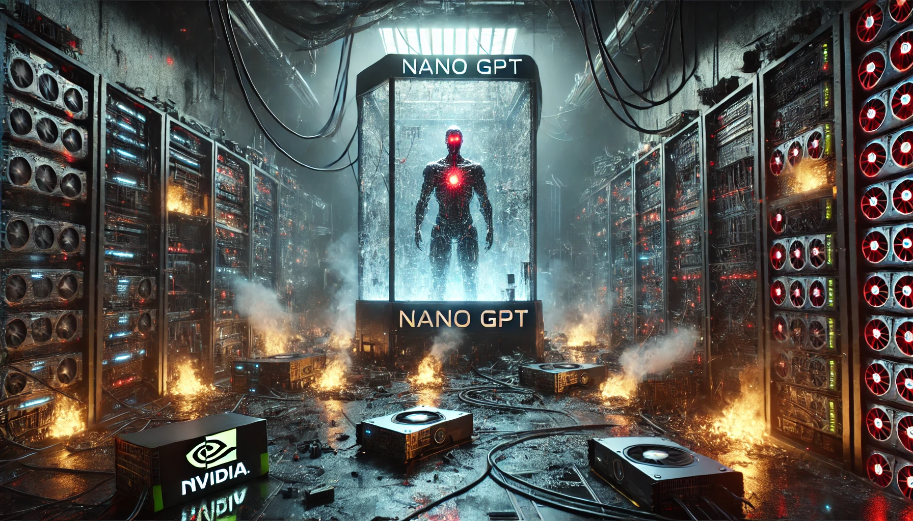

# nano-GPT-Tensorflow
<p align="center">
  
</p>

This repository is a lightweight experimentation playground that re-implements a GPT-2 style transformer with TensorFlow/Keras, wires it to a FineWeb-powered data pipeline, and adds a handful of custom optimization utilities. The sections below outline the architecture, data and training flow, installation steps, and current limitations.

## 🎯 Project Goals
- Build multi-layer transformer blocks à la GPT-2 using pure TensorFlow layers.
- Download a FineWeb EDU subset, shard it on disk, and expose it as TensorFlow `Dataset` objects for training.
- Train with a custom learning-rate scheduler that mixes warmup and cosine decay alongside an AdamW-inspired optimizer.
- Provide a starting point for multi-GPU experiments through TensorFlow distribution strategies (e.g., `MirroredStrategy`).

## 📂 Repository Layout
```
.
├── data/
│   └── fineweb_tf.py        # FineWeb download + sharding + TF dataset helpers
├── configs/
│   └── config.py            # JSON/YAML configuration loader (model + training)
├── optim/
│   ├── custom_LR.py         # Warmup + cosine decay learning rate schedule
│   ├── custom_optimizer.py  # AdamW variant with parameter-specific weight decay
│   └── gpu_config.py        # TensorFlow distribution strategy utilities
├── model.py                 # Pure TF implementation of GPT blocks, attention, and MLPs
├── gpt_train.py             # Training loop, checkpointing, and sample text generation
├── requirements.txt         # Python dependencies
└── README.md
```

## 🔧 Installation
1. **Python environment:** Python 3.10+ is recommended. Create a virtual environment:
   ```bash
   python -m venv .venv
   source .venv/bin/activate  # Windows: .venv\Scripts\activate
   ```
2. **Dependencies:**
   ```bash
   pip install -r requirements.txt
   ```
3. **GPU drivers:** A CUDA-capable NVIDIA GPU plus the matching CUDA/cuDNN stack is strongly recommended. CPU/TPU execution is technically possible but substantially slower.

## 🗂️ Configuration Files
The project currently references hard-coded Windows-style paths. Before running anything locally:
- Prepare config files similar to `configs/gpt2_.json` and `configs/training.yaml` (they can live outside the repo).
- Update `load_config(...)`, dataset paths, checkpoint directories, and output folders inside `gpt_train.py` and `model.py` so they match your environment.
- `configs/config.py` attempts to cast numeric fields (e.g., `max_steps`, `batch_size`) to `int`/`float`. Prefer numeric values over strings in your YAML/JSON files.

Example training config (`training.yaml`):
```yaml
max_steps: 200000
batch_size: 8
sequence_length: 1024
warmup_steps: 2000
max_lr: 0.0006
min_lr: 0.00006
weight_decay: 0.1
```

Example model config (`gpt2_.json`):
```json
{
  "vocab_size": 50257,
  "block_size": 1024,
  "n_layer": 12,
  "n_head": 12,
  "n_embd": 768,
  "attn_pdrop": 0.1,
  "resid_pdrop": 0.1
}
```

## 📥 FineWeb EDU Pipeline
The `data/fineweb_tf.py` module automates:
1. Downloading a 10% sample of the Hugging Face `HuggingFaceFW/fineweb-edu` dataset.
2. Tokenizing every document with the GPT-2 tokenizer.
3. Writing tokens into 100M-length NumPy `.npy` shards.
4. Marking the first shard as validation (`val`) and the remainder as training (`train`).

> **Note:** The script uses a multiprocessing pool, so memory and disk usage can spike. Reduce `shard_size` or adjust the `split` argument if you only need a small sample.

Once shards exist, `tf_dataset(...)` loads them as `tf.data.Dataset` objects, applies sequential token shifts to produce `(x, y)` pairs, and wires in shuffling, batching, and prefetching.

## 🚂 Training Workflow
1. Adapt the paths and hyperparameters in `gpt_train.py` to match your setup.
2. Launch training:
   ```bash
   python gpt_train.py
   ```
3. The script builds the model under the chosen distribution strategy (`optim/gpu_config.py`), initializes the optimizer and learning-rate schedule, and starts iterating.
4. Training loss, learning rate, gradient norm, and throughput are logged each step; validation loss runs every 100 steps by default.
5. Checkpoints are saved every 10,000 steps, and generated samples appear in `generated_text/`.
6. At the end, the model is serialized to disk using the Keras SavedModel format (`.keras`).

### Custom Components
- **`CustomAdamW`**: Lets you exclude LayerNorm/bias parameters from weight decay via explicit name lists.
- **`WarmupCosineSchedule`**: Produces a warmup phase followed by cosine-based decay.
- **`setup_strategy`**: Detects available GPUs and picks `MirroredStrategy` or falls back to a single device.

## 📌 Known Gaps & TODOs
- File-system paths are hard-coded; consider adding CLI flags or environment variables for portability.
- `model.GPT.from_pretrained` tries to call `model_config`, but that object is a dict. Refactor before enabling Hugging Face weight loading.
- `configs/config.py` is missing a trailing newline and could use cleanup.
- Distributed training support is minimal; mixed precision, gradient accumulation, and configurable checkpoint locations would help.

## 🤝 Contributing
1. Fork the repository.
2. Create a feature branch (`git checkout -b feature/awesome-idea`).
3. Commit and test your changes.
4. Open a pull request summarizing the modifications and any new configuration requirements.
